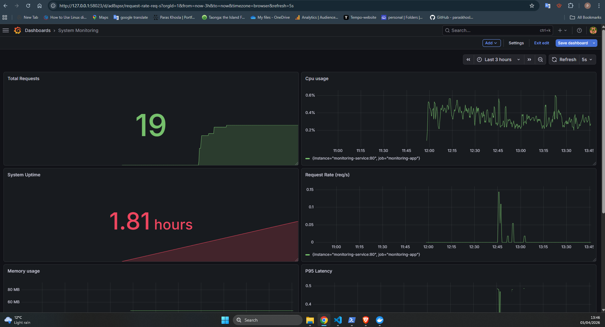
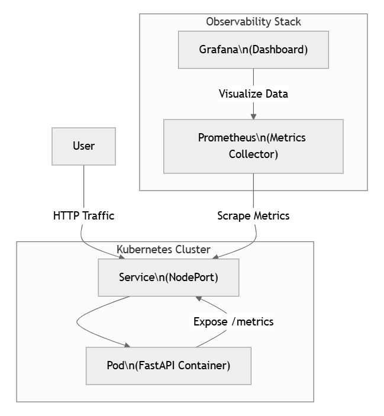
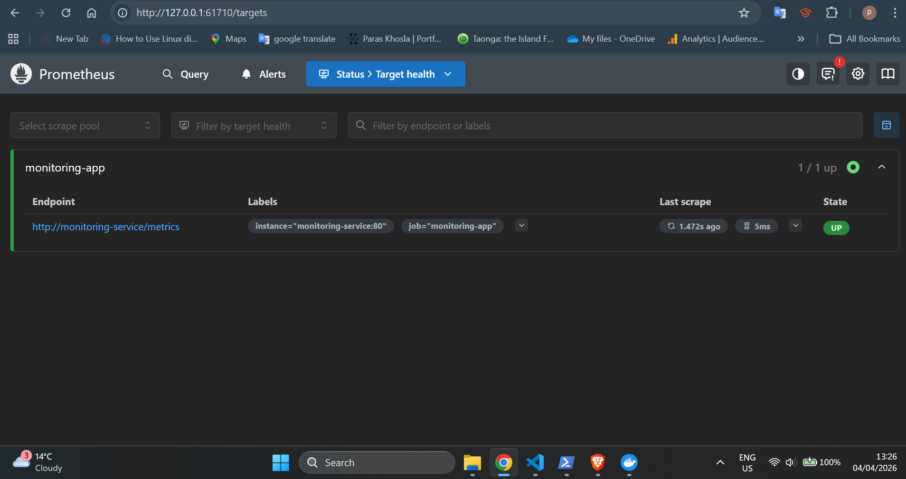
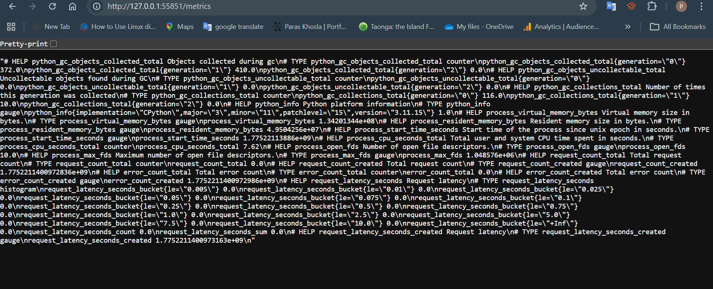

# Cloud-Native Monitoring System (Kubernetes, Prometheus, Grafana) 


## 📊 Grafana Dashboard Preview



This project implements a cloud-native monitoring system for a containerized application, providing real-time observability using Kubernetes, Prometheus, and Grafana.

## Why This Project

Modern distributed systems require strong observability to detect issues, optimize performance, and ensure reliability.  
This project was built to simulate a real-world monitoring setup used in production environments.

---

## Overview

The system provides real-time observability into application performance, including request rate, error rate, latency, and system resource usage.

It simulates a production-like monitoring setup using modern DevOps tools. This project demonstrates an end-to-end observability pipeline from application instrumentation to real-time visualization.

---

## Architecture

User → FastAPI App → Kubernetes → Prometheus → Grafana


This flow shows how requests generate metrics, which are scraped, stored, and visualized.

- FastAPI exposes metrics
- Prometheus scrapes metrics
- Grafana visualizes data

---

## Tech Stack

### Application
- FastAPI (Python)

### Containerization
- Docker

### Orchestration
- Kubernetes (Minikube)

### Monitoring
- Prometheus

### Visualization
- Grafana

---

## Features

- Real-time request monitoring
- Error tracking and analysis
- Latency measurement using histograms
- CPU and memory monitoring
- Kubernetes-based deployment
- Interactive Grafana dashboards

---

## Dashboard Metrics

The Grafana dashboard includes:

- Request Rate (req/s)
- Error Rate
- Error Percentage
- Average Latency
- P95 Latency
- CPU Usage
- Memory Usage

These metrics provide insights into system performance and reliability.

---

## Key Implementation Details

- Metrics exposed via `/metrics` endpoint
- Prometheus configured with Kubernetes service discovery
- Grafana connected to Prometheus as data source
- Kubernetes services used for internal communication

---

## Challenges & Fixes

### Issue: Prometheus scraping failed (Content-Type error)

**Problem:**
Prometheus could not scrape metrics due to incorrect response format.

**Error:**
unsupported Content-Type "application/json"

**Root Cause:**
FastAPI returned JSON instead of Prometheus-compatible format.

**Fix:**
```python
@app.get("/metrics")
def metrics():
    return Response(generate_latest(), media_type="text/plain")
```
	
**Result:**
- Prometheus target became **UP**



- Metrics successfully scraped



- Data visible in Grafana


## Getting Started

```bash
minikube start
kubectl apply -f k8s/
kubectl apply -f monitoring/
minikube service grafana-service
```

## What I Learned

- How Prometheus scraping works and common pitfalls (Content-Type issues)
- Kubernetes service discovery for monitoring
- End-to-end observability pipeline design
- Debugging real-world monitoring issues in distributed systems

## Future Improvements

- Add persistent storage for Grafana
- Deploy on cloud (Azure AKS / AWS EKS)
- Implement alerting (Prometheus Alertmanager)
- Use Helm for deployment automation
